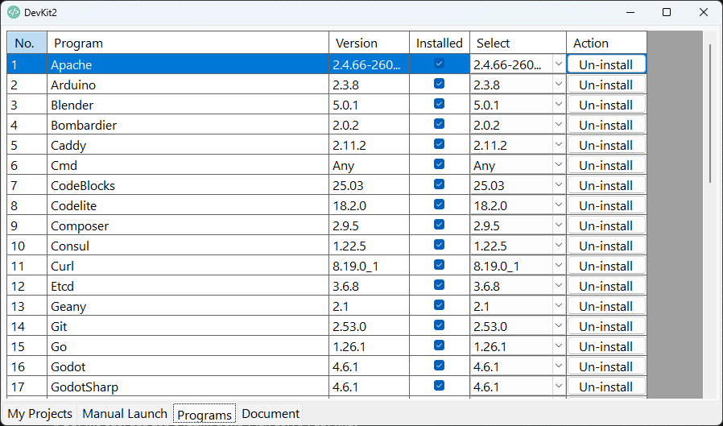

# DevKit2 Overview
DevKit2 is a portable and fully isolated development environment designed for modern polyglot development. It provides everything you need to work with:

- PHP
- Node.js
- Python
- Go
- Ruby
- Rust
- Zig
- Nim
- and more...

All in one fast and lightweight toolkit.

Unlike traditional development setups, DevKit2 installs nothing into your system. It runs entirely in its own environment, keeping your operating system clean, stable, and free from dependency conflicts.

With DevKit2, you can start coding immediately without worrying about system pollution, broken PATH variables, or conflicting runtimes.

## Getting Started
1. Download DevKit2
2. Extract the archive
3. Run the application

No installation required. No system changes. You're ready to go.

## Main Interface
DevKit2 is organized into four main tabs

### 1. My Projects

This tab displays your development projects.

- Each item represents a project or workspace
- Click an item to open or launch it
- Icons help you quickly identify project types (VSCode, database, server, etc.)

This is your central workspace dashboard.

### 2. Manual Launch

This tab allows you to manually launch development tools and services.

You can run tools such as:

- Apache
- Node.js
- Git
- VSCode
- Databases (MySQL, PostgreSQL, etc.)
- CLI tools (Curl, Cmd, etc.)

Use this tab when you want to:

- Start a specific tool manually
- Run utilities independently of projects

### 3. Programs

This tab is used to manage available software packages.

Features:
- View all supported programs
- Install or uninstall tools
- Select specific versions
- Enable/disable programs
Columns:
- Program → Name of the tool
- Version → Available version
- Installed → Whether it is installed
- Select → Choose version
- Action → Install / Uninstall

This is your package manager inside DevKit2.

### 4. Document

This tab provides built-in documentation and help.

- User guides
- Setup instructions
- Technical notes

## Key Advantages
### 1. Fully Portable
- No installation required
- Can run from USB or any folder

### 2. Isolated Environment
- No changes to system PATH
- No dependency conflicts

### 3. Multi-language Ready

Supports multiple ecosystems in one place:

- Backend (PHP, Node, Go, Python, Ruby)
- Systems (Rust, Zig, Nim)

### 4. Clean System
- No registry pollution
- No broken environments
- No leftover files

## Typical Workflow
- Open DevKit2
- Install required tools in Programs tab
- Launch tools via Manual Launch
- Open your project from My Projects
- Read documentation in Document

## Tips
- Keep DevKit2 projects in a dedicated folder (e.g., C:\My Projects)
- Avoid moving the folder after setup
- Use consistent project structure for better organization

## Summary
DevKit2 simplifies development by removing the complexity of environment setup.

Instead of managing multiple runtimes and configurations, everything is bundled into a single, portable toolkit.
